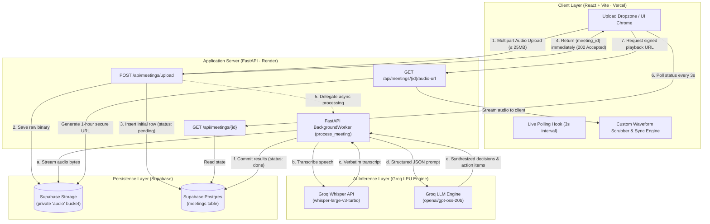
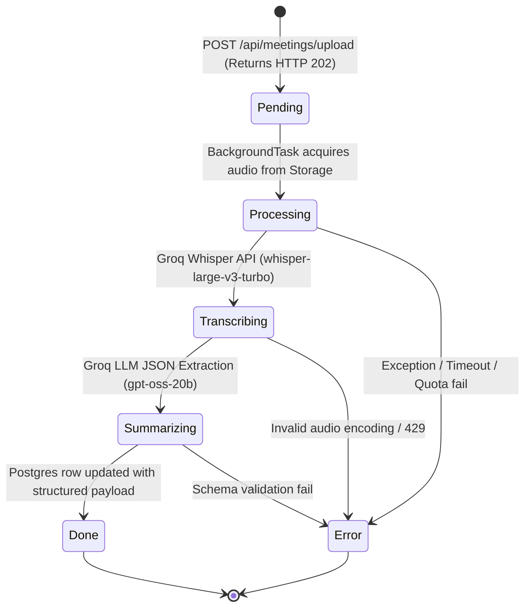
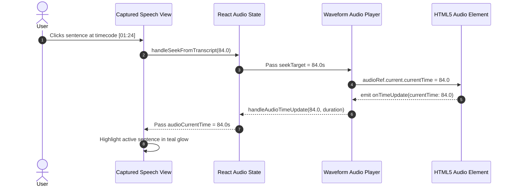

# 🎙️ AI Meeting Summarizer

> **Production-grade, speech-first meeting intelligence engine.** Converts recorded meeting audio into verbatim transcripts, synthesized executive takeaways, and assignable action items — operating entirely on a 100% free-tier cloud architecture.

---

## 🌐 Live Deployments & Cloud Infrastructure

| Resource | Target | Live URL | Status |
|---|---|---|---|
| **Web Client (Frontend)** | Vercel (Hobby Tier) | [https://meeting-summ.vercel.app/](https://meeting-summ.vercel.app/) |  |
| **API Server (Backend)** | Render (Web Service) | [https://meeting-summarizer-api-a4vv.onrender.com](https://meeting-summarizer-api-a4vv.onrender.com) |  |
| **Interactive API Docs** | Swagger / OpenAPI | [https://meeting-summarizer-api-a4vv.onrender.com/docs](https://meeting-summarizer-api-a4vv.onrender.com/docs) |  |
| **Postgres Database & Object Storage** | Supabase Cloud | [Supabase Project Dashboard](https://supabase.com/dashboard/project/feeqlrhtdjjsiysltwlu) |  |
| **GitHub Repository** | GitHub | [https://github.com/Asmitcod/meeting_summ](https://github.com/Asmitcod/meeting_summ) |  |

---

## 📐 System Architecture & Workflow

### 1. End-to-End Pipeline



---

### 2. Async Non-Blocking State Machine



---

### 3. Audio-Transcript Realtime Seeking Mechanism



---

## ⚡ Key Highlights & Engineering Decisions

1. **Non-Blocking Ingestion**: Single HTTP calls for long audio files risk connection timeouts on free hosting tiers (e.g. Render 30s limits). Uploads return `202 Accepted` with a UUID immediately; background workers handle transcription and synthesis while the frontend polls state transitions.
2. **Audio-Transcript Synchronous Seeking**: Clicking any transcript paragraph jumps the audio player straight to that timecode. The active playing line highlights in real time.
3. **Structured JSON Output Guarantee**: Enforces `response_format={"type": "json_object"}` on Groq with fallback regex normalization, guaranteeing predictable UI hydration for key decisions and action tasks.
4. **Private Storage & Time-Bound Signed URLs**: Supabase storage bucket is strictly private (zero anon read policies). The backend issues 1-hour expiring signed URLs (`GET /api/meetings/{id}/audio-url`) for playback.
5. **Cold-Start Resilience**: Free instances on Render sleep after inactivity. The client executes an initial lightweight `/health` wake-up ping and sets Axios timeouts to 60s.

---

## 🛠️ Technology Stack

| Layer | Framework / Service | Purpose |
|---|---|---|
| **Frontend UI** | React 18, Vite, TailwindCSS | Reactive audio player, tabbed panels, dropzone |
| **Typography** | Plus Jakarta Sans & JetBrains Mono | Distinct editorial UI vs. typewriter verbatim transcript |
| **Backend API** | FastAPI (Python 3.11), Uvicorn | Async route orchestration, BackgroundTasks |
| **Speech-to-Text (ASR)** | Groq Whisper (`whisper-large-v3-turbo`) | High-accuracy speech transcription (≤ 25 MB) |
| **Language Model (LLM)** | Groq (`openai/gpt-oss-20b`) | Decision extraction and task assignment |
| **Database & ORM** | Supabase Postgres (via `supabase-py` & Pydantic v2) | Relational persistence, JSONB collections |
| **Object Storage** | Supabase Storage (S3-compatible bucket) | Encrypted meeting audio files |
| **Testing** | Pytest, Pytest-Asyncio, HTTPX | Route validation, JSON parsing, mock service suites |

---

## 🚀 Local Development Setup

### Prerequisites
- **Python 3.11+**
- **Node.js 18+** & npm
- A free [Groq Cloud API Key](https://console.groq.com)
- A free [Supabase Project](https://supabase.com)

---

### Step 1: Database Provisioning

Open your [Supabase SQL Editor](https://supabase.com/dashboard/project/feeqlrhtdjjsiysltwlu/sql) and run:

```sql
-- Schema initialization
create extension if not exists pgcrypto;

create table if not exists public.meetings (
    id              uuid primary key default gen_random_uuid(),
    title           text not null,
    audio_path      text,
    transcript      text,
    summary         text,
    key_decisions   jsonb default '[]'::jsonb,
    action_items    jsonb default '[]'::jsonb,
    status          text not null default 'pending' 
                    check (status in ('pending','processing','done','error')),
    error_message   text,
    created_at      timestamptz not null default now(),
    updated_at      timestamptz not null default now()
);

create index if not exists idx_meetings_status on public.meetings (status);
create index if not exists idx_meetings_created_at on public.meetings (created_at desc);

-- Private audio bucket
insert into storage.buckets (id, name, public) values ('audio', 'audio', false)
on conflict (id) do nothing;
```

---

### Step 2: Backend Setup

```bash
cd backend
python -m venv .venv

# Windows
.venv\Scripts\activate
# macOS / Linux
source .venv/bin/activate

pip install -r requirements.txt

# Configure environment variables
cp .env.example .env
```

Edit `backend/.env`:
```env
GROQ_API_KEY=gsk_your_groq_api_key
SUPABASE_URL=https://feeqlrhtdjjsiysltwlu.supabase.co
SUPABASE_SERVICE_ROLE_KEY=eyJhbGciOi...
ALLOWED_ORIGINS=http://localhost:5173,https://meeting-summ.vercel.app
MAX_FILE_SIZE_MB=25
```

Start the API server:
```bash
uvicorn main:app --reload --port 8000
```
- API Endpoint: `http://localhost:8000`
- Interactive Swagger UI: `http://localhost:8000/docs`

---

### Step 3: Frontend Setup

```bash
cd frontend
npm install

# Start Vite dev server
npm run dev
```
- Web Application: `http://localhost:5173`

---

## 🧪 Verification & Test Suite

Run the automated Pytest test suite:

```bash
cd backend
.venv\Scripts\activate
pytest tests/ -v
```

```
tests/test_meetings.py::test_health_check PASSED                         [  8%]
tests/test_meetings.py::test_upload_rejects_wrong_content_type PASSED    [ 16%]
tests/test_meetings.py::test_upload_rejects_oversized_file PASSED        [ 25%]
tests/test_meetings.py::test_upload_success PASSED                       [ 33%]
tests/test_meetings.py::test_list_meetings PASSED                        [ 41%]
tests/test_meetings.py::test_get_meeting_not_found PASSED                [ 50%]
tests/test_summarization.py::test_extract_json_clean PASSED              [ 58%]
tests/test_summarization.py::test_extract_json_with_markdown_fences PASSED [ 66%]
tests/test_summarization.py::test_extract_json_raises_on_no_json PASSED  [ 75%]
tests/test_summarization.py::test_summarize_transcript_success PASSED    [ 83%]
tests/test_summarization.py::test_summarize_transcript_bad_json_raises PASSED [ 91%]
tests/test_summarization.py::test_summarize_transcript_api_error_raises PASSED [100%]

======================== 12 passed in 0.66s ========================
```

---

## 📡 REST API Reference

### Endpoints Overview

| Method | Route | Description | Status Code |
|---|---|---|---|
| `GET` | `/health` | Liveness check & cold-start wake ping | `200 OK` |
| `POST` | `/api/meetings/upload` | Upload audio file (multipart/form-data) | `202 Accepted` |
| `GET` | `/api/meetings` | List all past meetings ordered by `created_at DESC` | `200 OK` |
| `GET` | `/api/meetings/{id}` | Get full meeting detail, transcript, and summary | `200 OK` / `404` |
| `GET` | `/api/meetings/{id}/audio-url` | Generate temporary signed audio playback URL | `200 OK` / `404` |
| `DELETE` | `/api/meetings/{id}` | Delete database record and storage audio object | `204 No Content` |

### Sample Response: `GET /api/meetings/{id}`

```json
{
  "id": "cc7ad322-e214-41fb-bbd7-3e9d042aaf56",
  "title": "Q3 Engineering Sync",
  "audio_path": "cc7ad322-e214-41fb-bbd7-3e9d042aaf56/recording.mp3",
  "status": "done",
  "summary": "The team aligned on the migration to Groq Whisper for audio transcription. Frontend timeline was moved up by two weeks.",
  "key_decisions": [
    "Adopt Groq Whisper large-v3-turbo as standard ASR engine",
    "Release MVP to internal beta testing on Friday"
  ],
  "action_items": [
    {
      "task": "Finalize Supabase Storage RLS policies",
      "owner": "Alex Rivera",
      "deadline": "Thursday 5 PM"
    }
  ],
  "created_at": "2026-08-24T14:03:16.598Z",
  "updated_at": "2026-08-24T14:03:28.112Z"
}
```

---

## 📁 Repository Structure

```
Meeting_summarizer/
├── README.md                      # Comprehensive project documentation
├── SYSTEM_DESIGN.md               # In-depth architectural & system design doc
├── .gitignore                     # Git exclusion rules
├── backend/
│   ├── main.py                    # FastAPI application, CORS & lifespan hooks
│   ├── config.py                  # Pydantic v2 settings management
│   ├── database.py                # Supabase client singleton
│   ├── models.py                  # Pydantic schemas (Request / Response)
│   ├── schema.sql                 # Supabase Postgres schema & storage setup
│   ├── requirements.txt           # Python backend dependencies
│   ├── .env.example               # Backend environment variable template
│   ├── routers/
│   │   ├── __init__.py
│   │   └── meetings.py            # API routes (/api/meetings/*)
│   ├── services/
│   │   ├── __init__.py
│   │   ├── transcription.py       # Groq Whisper integration service
│   │   └── summarization.py       # Groq LLM structured JSON service
│   └── tests/
│       ├── __init__.py
│       ├── test_meetings.py       # Route & validation test cases
│       └── test_summarization.py  # LLM JSON parsing & resilience test cases
└── frontend/
    ├── index.html                 # HTML shell with Google Fonts
    ├── package.json               # Frontend dependencies & build scripts
    ├── vite.config.js             # Vite bundler configuration
    ├── tailwind.config.js         # Charcoal & Muted Teal theme definitions
    ├── postcss.config.js          # Tailwind PostCSS configuration
    └── src/
        ├── main.jsx               # React DOM entry point
        ├── App.jsx                # Core workspace orchestrator & polling loop
        ├── index.css              # Global styles & keyframe animations
        ├── api/
        │   └── meetings.js        # Axios API client (60s timeout configured)
        └── components/
            ├── IntroSplash.jsx    # First-load left-to-right glowing mic animation
            ├── UploadForm.jsx     # Flat dropzone with file validation
            ├── AudioPlayer.jsx    # Custom waveform scrubber & playback controls
            ├── ResultTabs.jsx     # Synthesis, Actions, and Synced Transcript
            ├── ActionItem.jsx     # Checkable task cards with owner avatars
            ├── StatusBanner.jsx   # Multi-step pipeline progression indicator
            └── MeetingList.jsx    # Library sidebar with real-time state & search
```

---

## 📄 License & Attribution

Built for meeting transcription and decision intelligence.  
Powered by [Groq](https://groq.com), [Supabase](https://supabase.com), [FastAPI](https://fastapi.tiangolo.com), and [Vercel](https://vercel.com).
