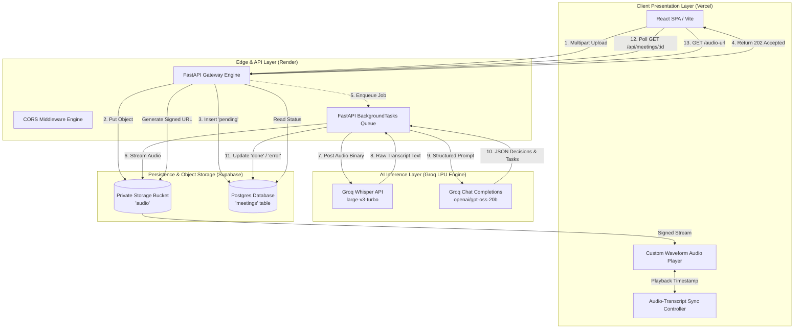
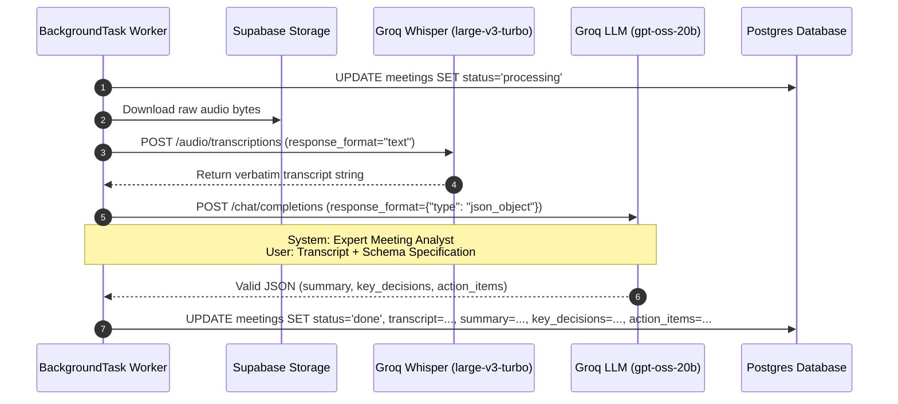
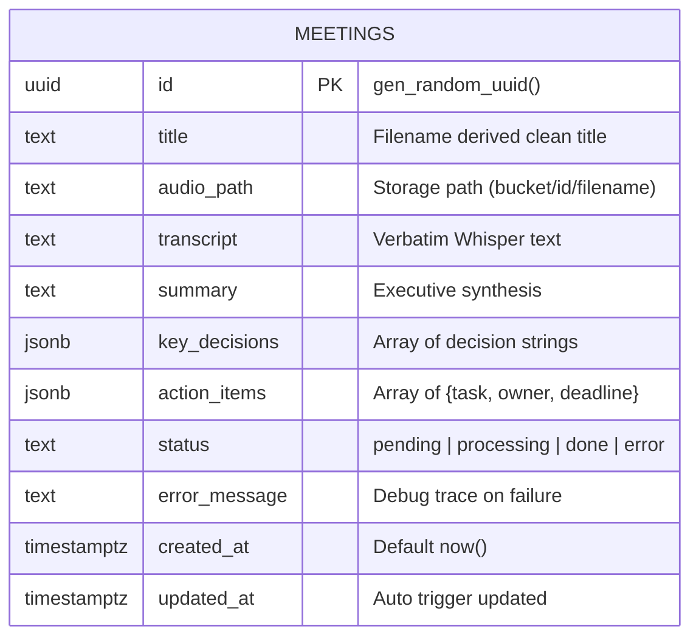

# 🏛️ System Design Document: AI Meeting Summarizer

**Document Version:** 1.0  
**Author:** Engineering Team  
**Architecture Model:** 100% Free-Tier Cloud Ecosystem  
**Target Deployments:** Vercel (Client), Render (API Worker), Groq Cloud (Inference), Supabase (Postgres & Storage)

---

## 1. System Overview & Objectives

The **AI Meeting Summarizer** is an automated audio intelligence system designed to ingest meeting recordings, transcribe spoken speech into searchable text, extract key decisions, and identify actionable tasks with assignees and deadlines.

### Key Design Goals
- **Zero-Infrastructure Cost**: Operates entirely within the free-tier allowances of all underlying vendors.
- **Non-Blocking Architecture**: Long-running speech-to-text and LLM synthesis jobs do not block HTTP request/response lifecycles.
- **Deterministic Structured Output**: LLM outputs conform to a strict JSON schema without hallucinated formatting or markdown syntax leakage.
- **Audio-Text Tight Coupling**: Verbatim transcript segments maintain bidirectional synchronization with an interactive waveform audio scrubber.

---

## 2. High-Level Architecture Diagram



---

## 3. Component Deep Dive

### 3.1 Client Layer (React + Vite)
- **State Management**: Reactive polling loop executing every 3,000 ms during `pending` or `processing` states, terminating immediately upon reaching `done` or `error`.
- **Waveform Scrubber**: Pseudo-waveform bar array generated deterministically from the audio title string, synchronized with the HTML5 audio element's `currentTime` and `duration`.
- **Speech Sync**: Dynamically calculates segment time offsets, highlighting the current paragraph during playback and triggering `audio.currentTime = offset` upon sentence click.

### 3.2 Backend Service (FastAPI)
- **Asynchronous Ingestion**: When an audio payload is received at `POST /api/meetings/upload`, the server:
  1. Validates MIME type against `ALLOWED_AUDIO_TYPES` (`audio/mpeg`, `audio/wav`, `audio/mp4`, `audio/ogg`, etc.).
  2. Verifies byte length against `max_file_size_bytes` (25 MB limit).
  3. Writes the raw binary to Supabase Storage at `{meeting_id}/{filename}`.
  4. Inserts a row in Postgres with `status = 'pending'`.
  5. Dispatches `process_meeting(meeting_id)` to `BackgroundTasks`.
  6. Emits `UploadResponse(meeting_id=...)` with HTTP status `202 Accepted`.

---

## 4. Speech-to-Text & LLM Synthesis Pipeline



### LLM Prompt & Schema Specification

The LLM is prompted with a strict schema to prevent markdown code-fence bleeding:

```json
{
  "summary": "3 to 5 sentence executive summary of the entire meeting",
  "key_decisions": [
    "Decision 1",
    "Decision 2"
  ],
  "action_items": [
    {
      "task": "Description of the task",
      "owner": "Person responsible or 'Unassigned'",
      "deadline": "Deadline if mentioned or 'Not specified'"
    }
  ]
}
```

---

## 5. Database Schema & Storage Security

### Relational Entity-Relationship Diagram



### Storage Security Model
- **Bucket Policy**: The `audio` bucket is configured with `public = false`.
- **Row Level Security (RLS)**: RLS is enabled on `public.meetings` with zero anonymous policies.
- **Service Role Isolation**: Only the backend API, utilizing the `SUPABASE_SERVICE_ROLE_KEY`, can read/write objects or rows.
- **Signed Playback URLs**: For browser playback, the backend generates short-lived signed URLs (`expires_in = 3600`), preventing unauthorized URL scraping.

---

## 6. Fault Tolerance & Resiliency Engineering

| Failure Scenario | Impact | Mitigation Mechanism |
|---|---|---|
| **Render Service Cold Start** | API calls take 30–50s on initial wake | Frontend triggers a pre-flight `/health` ping and sets Axios timeout to 60,000 ms with UI status `waking`. |
| **Oversized Audio (> 25MB)** | Groq Whisper rejects upload | Dual-stage validation: Client dropzone rejects files > 25MB before upload; API rejects with HTTP 400. |
| **LLM Output Malformation** | JSON parsing throws syntax error | Enforces `response_format={"type": "json_object"}` with fallback regex extraction in `_extract_json`. |
| **API Rate Limits (429)** | Background worker fails job | Catches HTTP 429, transitions row to `status: 'error'`, and surfaces actionable retry message to UI. |

---

## 7. Scalability & Future Evolution

1. **Audio Chunking Engine**: Split audio files > 25MB using `ffmpeg-python` into sequential 10-minute segments before feeding Whisper in parallel, concatenating transcripts before synthesis.
2. **Speaker Diarization**: Integrate PyAnnote or Deepgram to label speakers (`Speaker 01`, `Speaker 02`) in the transcript and associate action items directly to detected speaker identities.
3. **Real-time WebSockets / SSE**: Replace 3-second client polling with Server-Sent Events (SSE) for instantaneous real-time transcription streaming.
